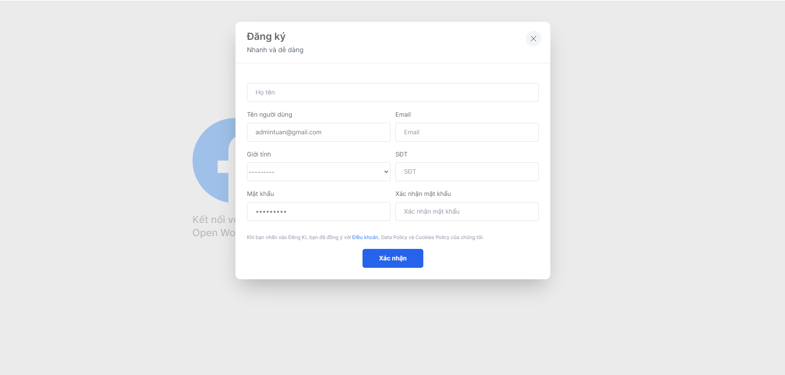

# Facebook Clone
Description: Sign Up, Login, Logout, Update Profile, Manage Profile, Change Password, Search User, Notification, Create Post, Update Post, 
Delete Post, Like Post, Comment Post, Like Comment, Delete Comment, Chat Message(text, file, image) and Call Video.
## Getting started
### Download project
1. Change into the project directory: 
 ```bash
   git clone https://github.com/tikjuti/social-media.git
   ```
2. Navigate to the project directory: 
 ```bash
   cd social-media
   ```
### Start

1. Create the virtual environment:
 ```bash 
   python3 -m venv env (for windows --> python -m venv env)
   ```
2. Activate the virtual environment:
 ```bash
   source env/bin/activate (for windows --> env\scripts\activate)
   ```
3. Install packages:
 ```bash
   pip install -r requirement.txt (same for both)
   ```
4. Update the database:
 ```bash
   python manage.py migrate
   ```
5. Start the server:
 ```bash
   python manage.py runserver
   ```
## Overview
### 1. Home page


### 2. Register




### 3. Login


### 4. Update Profile


### 5. Manage Profile


### 6. Change Password


### 7. Create Post


### 8. Update Post


### 9. Chat Message


### 10. Call Video


